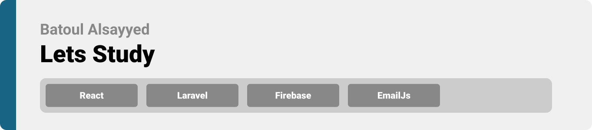
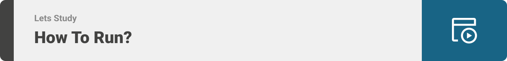

<div align="center">

> Hello world! This is the project’s summary that describes the project plain and simple, limited to the space available. 

> **[PROJECT PHILOSOPHY](#title2) • [WIREFRAMES](#title3) • [TECH STACK](#title4) • [IMPLEMENTATION](#title5) • [HOW TO RUN?](#title6)**

</div>

<br><br>


> The Well website is an online study platform. The website itself is not just any study platform that shows random students and tutors that you can study with; it encourages students to study with different people from all around the world where they can rate their study colleagues and tutors and chat with them to facilitate the communication processs without the need of outside chating apps where they can waste their time.

### User Stories

### As a student:

- As a regular student, I can view all students from all around the world to study with.
- I can rate other students.
- I can chat with other students where I get notified each time I receive a message.
- I can join live zoom meetings with other students.
- I can view messages sent from other students and send messages to them as well.
- I get notified each time another student sends me a message.

### As a pro student:

- I can view all tutors and students that are out there.
- I can rate tutors and other students.
- I can chat with other tutors and students where I get notified each time I receive a message.
- I can join live zoom meetings with other students/tutors.
- I can view messages sent from other students/tutors and send messages to them as well.
- I get notified each time another student/tutor sends me a message.

### As a tutor:

- I can view other tutors/students where I can chat with them and rate them.
- I can view messages sent from teachers/students and send messages to them as well.
- I get notified each time another student/tutor sends me a message.

### As an admin:

- I can view all users, students, teachers, degrees and studyfields.
- I can add tutors or delete them.
- I can add degrees and studyfields or delete them.
  <br><br>


> This design was planned before on paper, then moved to Figma app for the fine details.
> Note that i didn't use any styling library or theme, all from scratch and using pure css modules
> | Landing | Students |
> | -----------------| -----|
> |  |  |

| Study                                                                                             | Student Info                                                                                            |
| ------------------------------------------------------------------------------------------------- | ------------------------------------------------------------------------------------------------------- |
|  |  |

<br><br>


Here's a brief high-level overview of the tech stack the Well app uses:

- This project uses the [React javascript library](https://reactjs.org/). React is a free source frontend javascript library that is used for building user interfaces based on UI components.
- For persistent storage (database), the app uses [Laravel](https://laravel.com/) which allows the app to create a custom storage schema and save it to a local database.
- To chat with students/tutors, the website uses [firebase](https://firebase.google.com/?gclid=CjwKCAjwlqOXBhBqEiwA-hhitCphhzPAVql_jB65HPZoS20AsUhTfaUUWT__--BRk05iAhNKsTEzShoC_sgQAvD_BwE&gclsrc=aw.ds) which is a platform developed by Google for creating mobile and web applications.
- For notifications, the website sends notifications using EmailJs every time a user receives a message.

<br><br>


> Using the above mentioned tech stacks and the wireframes build with figma from the user sotries we have, the implementation of the app is shown as below, these are screenshots from the real app
> | Landing | Teacher Home page |
> | -----------------| -----|
> |  |  |

> | Teachers                                                                                 | Students                                                                                 |
> | ---------------------------------------------------------------------------------------- | ---------------------------------------------------------------------------------------- |
> |  |  |

> | Login                                                                                   | Register                                                                                      |
> | --------------------------------------------------------------------------------------- | --------------------------------------------------------------------------------------------- |
> |  |  |

<br><br>


> This is an example of how you may give instructions on setting up your project locally.
> To get a local copy up and running follow these simple example steps.

### Prerequisites

This is an example of how to list things you need to use the software and how to install them.

- npm
  ```sh
  npm install npm@latest -g
  ```

### Installation

_Below is an example of how you can instruct your audience on installing and setting up your app. This template doesn't rely on any external dependencies or services._

1. Clone the repo
   ```sh
   git clone https://github.com/Batoul-Alsayyed/Lets-Study.git
   ```
2. Install NPM packages
   ```sh
   npm install
   ```
3. Open a new terminal
   ```sh
   cd backend
   ```
4. Run
   ```sh
   composer install
   ```
5. Install [Xampp](https://www.apachefriends.org/)
6. Open Xampp
7. Run Apache and MySQL
8. create a new database called "letsstudy"
9. Run

```sh
   php artisan migrate
```

10. Run

```sh
php artisan serve
```

11. Now open up a new terminal and run

```sh
cd frontend
```

13. Run

```sh
 npm start
```
